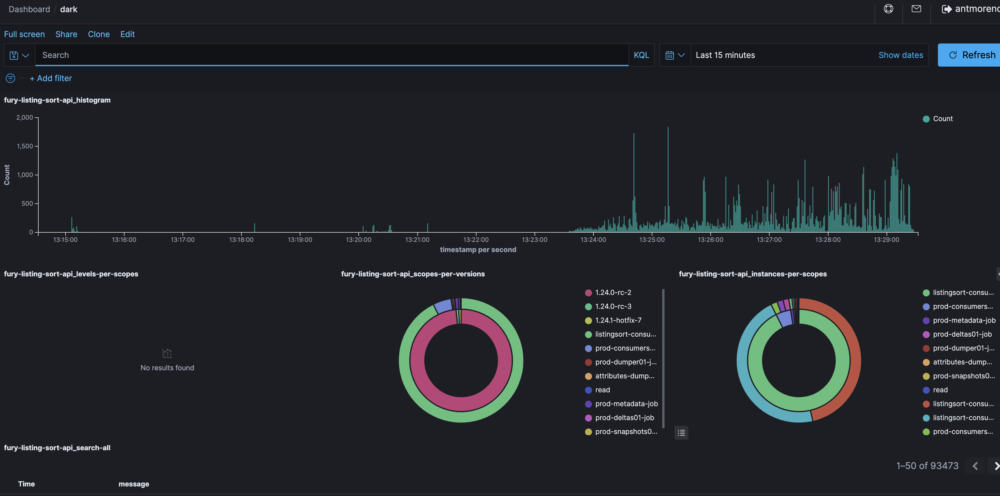
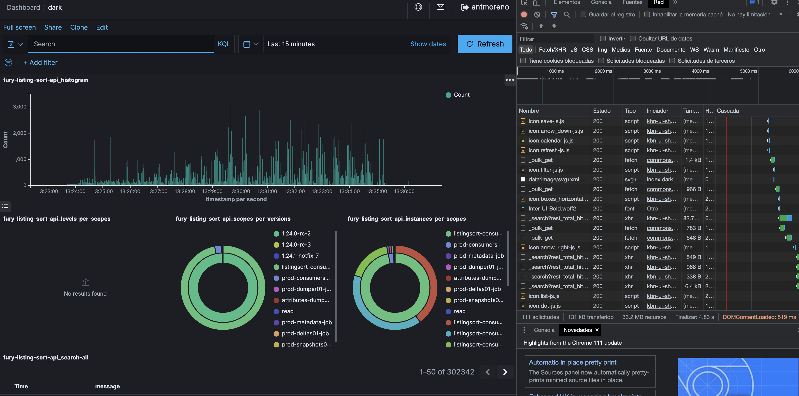
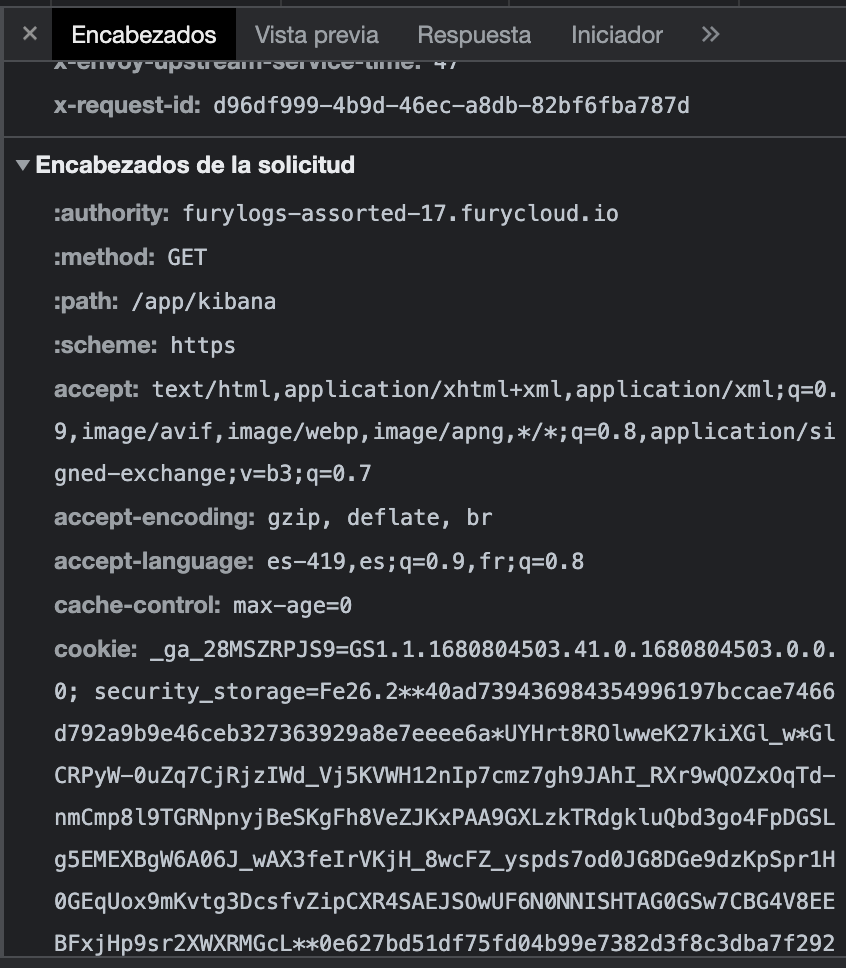

# Log-Reports

Tool to scrap data from Kibana logs
# How to use

1. Clone the repo.
2. Go to a Kibana dashboard.

3. Open the Network inspection chrome tool.
4. Refresh the Kibana dashboard.

5. Search for any kibana request and search to the request headers.

6. Copy the cookie header.
7. Paste the cookie header into the main.go file.

8. Exec ```go run main.go```

The report is created into the reports folder.

